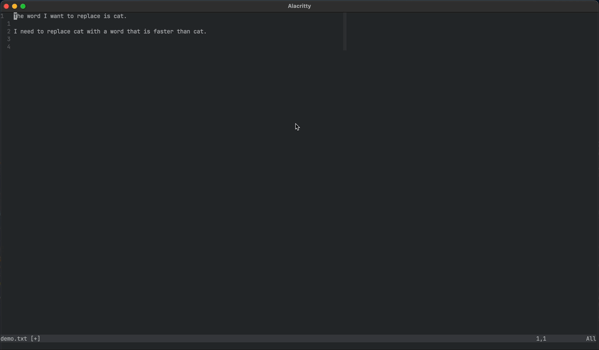

# one-replace.nvim

Easily search and replace with just one line of text.



## Installation

You can install `one-replace.nvim` using [lazy.nvim](https://github.com/folke/lazy.nvim). Add the following to your plugin specifications:

```lua
return {
  "dantevazquez/one-replace.nvim",
  keys = {
    { 
      -- feel free to change keybind here
      "<leader>r", 
      function() require("one-replace").open_prompt() end, 
      desc = "Quick Search and Replace" 
    },
  },
  config = function()
    require("one-replace").setup()
  end,
}
